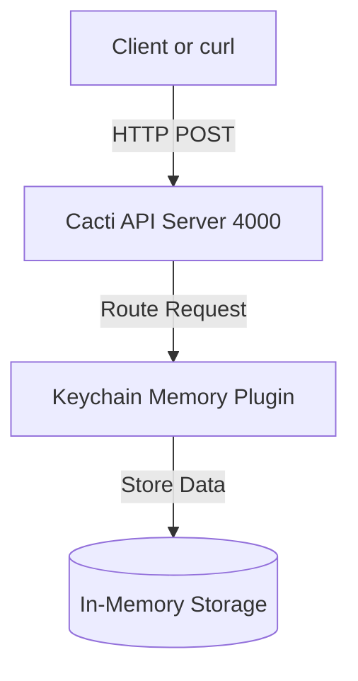

# Cacti Starter: Minimal Onboarding Template

Welcome to the Hyperledger Cacti Starter! This template provides the simplest possible "Hello World" experience for new contributors. It demonstrates Level 2 architecture (API Server + Plugin) with minimal setup.

## Quick Start

```bash
cd examples/cacti-starter
./bootstrap.sh
./run.sh
```

Swagger UI: [http://127.0.0.1:4000/api/v1/api-docs/](http://127.0.0.1:4000/api/v1/api-docs/)

## Test the Keychain Plugin

In a new terminal:

```bash
./test.sh
```

## Architecture

- **API Server**: Runs the Cacti REST API
- **Plugin**: Only `@hyperledger/cactus-plugin-keychain-memory` is loaded
- **No JWT, No TLS**: Authentication and encryption are disabled for simplicity

> **Note on TLS configuration**: Even though TLS is disabled in this starter (`"apiTlsEnabled": false`), the Cacti v3 framework configuration schema strictly enforces the presence of TLS certificate strings and validates them when booting its internal gRPC server. Because of this, the `.config.json` includes dummy self-signed certificates. This is the correct setup for a local development "No TLS" environment in v3. For a production environment, you would replace these strings with real CA-signed certificates and set TLS to true.



## Purpose

- Help new contributors get started in minutes
- Provide a working, hackable Cacti setup
- Avoid all unnecessary complexity

---

## Environment Setup (Ubuntu / Linux)

If you are starting from scratch on Ubuntu, follow these prerequisites to get your environment ready:

#### 1. Git

```bash
sudo apt update
sudo apt install -y git
```

#### 2. Node.js (v20.20.0) & npm

Use nvm (Node Version Manager):

```bash
curl -o- https://raw.githubusercontent.com/nvm-sh/nvm/v0.39.7/install.sh | bash
source ~/.bashrc
nvm install 20.20.0
nvm use 20.20.0
```

#### 3. Yarn (via Corepack)

```bash
corepack enable
```

#### 4. Docker Engine & Compose

Docker is required if you plan to run blockchain ledgers.

```bash
sudo apt install -y docker.io docker-compose
sudo systemctl start docker
sudo systemctl enable docker
sudo usermod -aG docker $USER
newgrp docker
```
